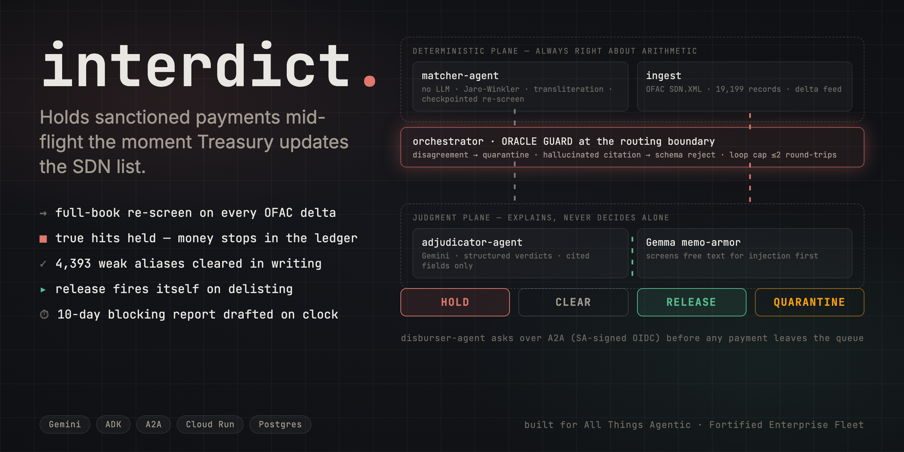
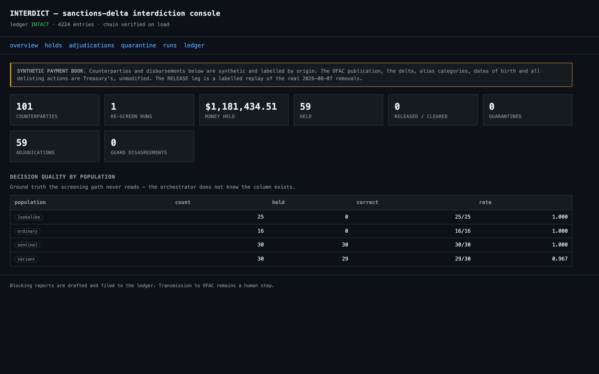
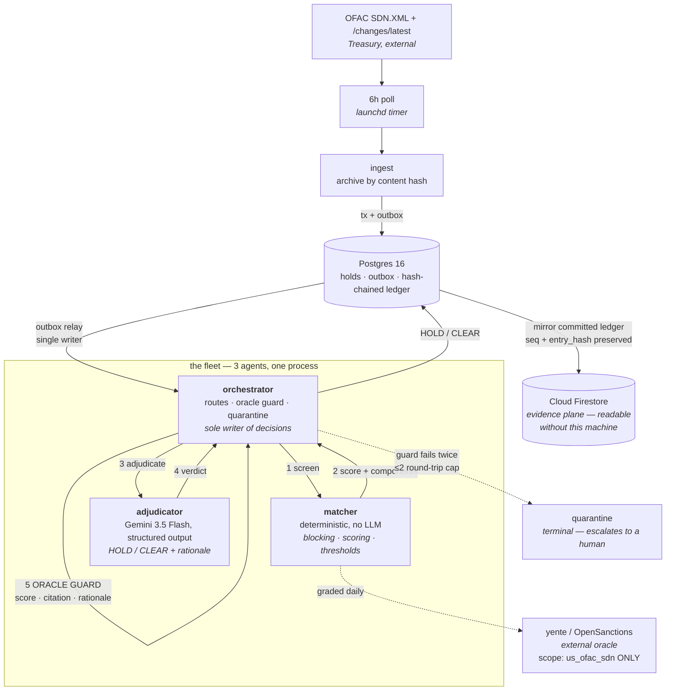

<div align="center">


# Interdict

**When Treasury updates the OFAC list, it re-screens the whole payment book, holds true hits, clears lookalikes with written reasons, releases funds on delisting, and drafts the 10-day blocking report — unattended.**



[**Demo video**](#-demo) · [**Reproduce the numbers**](#-reproduce) · [**Architecture**](#-architecture)


</div>

---

## 🎯 The problem

Every US person is strictly liable for payments to OFAC-designated parties — including a
12-person humanitarian NGO with no compliance department. When Treasury publishes a
change to the SDN list, the entire counterparty book has to be re-screened before the
next disbursement run. A true hit must be blocked and reported within **10 business
days**. A delisting means blocked funds must be released.

Screening vendors sell this to banks for $30k+/year. They do not sell to this operator
at all. So it gets done by hand, late, or not at all.

## ⚙️ What it does

One flow, end to end, with no human in the loop:

> **OFAC delta lands → full-book re-screen → true hits held (money stops) → lookalikes
> cleared with written rationale → funds released on delisting → 10-day blocking report
> drafted.**

### The four autonomous decisions

Each one acts without a click, and each is graded against something we do not control.

| | Decision | What moves | Who grades it |
|---|---|---|---|
| 1 | **HOLD** | an idempotent hold freezes every queued disbursement to the counterparty | the SDN record on treasury.gov; `make challenge` reproduces it for any name |
| 2 | **CLEAR** | the disbursement proceeds, with the reason on record — the signal breakdown that ended it, or the model's rationale when the band was close enough to spend one | OpenSanctions **yente**, scope-pinned to `us_ofac_sdn` |
| 3 | **RELEASE** | a delisting retires the hold and the money moves again | Treasury's own published delta (`/changes/latest`) |
| 4 | **REPORT** | the blocking report is drafted against the statutory clock and filed to the ledger | the federal calendar, 5 U.S.C. 6103 |

## 📊 The numbers

Every figure below is produced by a script in this repo and can be re-run.

### Screening quality — measured on names that are *not* on the list

Screening the seeded book verbatim scores **top-1 = 1.000**, and that number is close to
worthless: those names were copied out of the very publication being searched, so
finding them is a string-equality test wearing a costume.

So the reported number screens **deterministic perturbations** instead — transliteration
families taken from OFAC's own alias lists, token reordering, dropped particles,
transcription confusables, dropped middle names. Each variant is derived from the
SHA-256 of the name, so the challenge set is byte-identical on any machine.

| | Interdict | yente (independent) |
|---|---|---|
| recall | **1.000** | — |
| **top-1** | **0.995** | **0.840** |
| reaching the adjudication bar | 0.978 | — |

`make challenge-set` · full result set in [`data/g1-perturbed.json`](data/g1-perturbed.json)

### Decision quality — graded against ground truth the system cannot see

Measured on a **stratified sample of 101** counterparties, adjudicated by
`gemini-3.5-flash-lite`. Free-tier Gemini caps requests per model per project per day, so
grading every one of 536 against the real model is not something that fits in a day; the
sample keeps all four strata and holds the two that test judgement at full strength.
Reproduce with `python scripts/load_book.py --truncate --sentinels 30 --variants 30
--lookalikes 30`.

The book carries the verdict a correct system must reach. The screening path never reads
that column — the orchestrator does not know it exists.

| population | | expected | correct | reached the model |
|---|---|---|---|---|
| **sentinel** (30) | on the list, exact names | HOLD | 30 / 30 | 30 |
| **variant** (30) | same person, different transliteration | HOLD | 29 / 30 | 29 |
| **lookalike** (25) | *different* person, shared surname, contradicting DOB | CLEAR | 25 / 25 | **0** |
| **ordinary** (16) | unrelated grantees | CLEAR | 16 / 16 | **0** |

**1 missed hit in 60. 0 frozen grantees in 41.** The two errors are reported separately
because they are not equivalent: a missed hit is a payment to a designated party, a frozen
grantee is aid stopped in error. The one miss is `AZIZ ATRIQ` at 0.6594 — a transliteration
the *screening* plane scored below the adjudication bar, so the model never saw it.

#### The right-hand column is the honest part

**Not one CLEAR-expected counterparty reached the model.** All 59 adjudications came back
HOLD, and every clear in this book was issued by the deterministic plane, because a
contradicting date of birth cuts a lookalike below `T_HI` before adjudication is ever
spent on it.

That is the design working — proving two people are different from documented evidence
does not need a language model, and the cheap path is also the auditable one. But it
means this table grades **the matcher on clears and the model on holds**, and an earlier
revision of it reported "lookalike CLEAR 60/60" as decision quality when the adjudicator
had played no part. The model's demonstrated contribution here is confirming 59 holds
with a citation and a signable rationale, and disagreeing with none of them.

### Agreement with the independent oracle, on every decision

yente is consulted for **every** adjudication, not only where it agrees — an oracle
consulted selectively is not an oracle.

| | count |
|---|---|
| both flagged a hit | **58** |
| we held, yente missed | 1 |
| **we cleared, yente flagged** | **0** |

The zero is the one that matters. Under strict liability the dangerous direction is
being *more permissive* than the oracle, and we never are.

The oracle guard passed all 59 verdicts (`AGREE`), and nothing reached quarantine.

### The console



Run history, held money against the statutory clock, every adjudication with its
rationale and the oracle beside it, quarantine, and the ledger with its chain verified
on page load. The `model` column names whichever adjudicator produced each verdict, so
a viewer can see at a glance whether it came from the product path or the offline
stand-in.

More: [holds](docs/assets/screenshots/console-holds-dark.png) ·
[adjudications](docs/assets/screenshots/console-adjudications-dark.png) ·
[runs](docs/assets/screenshots/console-runs-dark.png) ·
[ledger](docs/assets/screenshots/console-ledger-dark.png)

### Performance

`make bench` — deterministic screening plane, 400 counterparties against all 19,199 SDN
records of the **08/07/2026 publication** — the snapshot this whole build is sealed to; see
[What is real, and what is not](#️-what-is-real-and-what-is-not):

| p50 | p95 | p99 | full book |
|---|---|---|---|
| **9.3 ms** | 68.8 ms | 106.7 ms | **7.6 s** |

OFAC publishes roughly weekly.

## 🏗 Architecture

Three agents behind one routing boundary. The deterministic plane is the **oracle for the
model plane**, and the guard sits on the return path so a verdict is checked before it is
allowed to move money.

**They run in a single process.** The separation is enforced by the `Adjudicator`
protocol and the oracle guard, not by a network hop — every model call is confined to
`interdict/adjudicator.py`, which is what makes the guard in `interdict/orchestrator.py`
a real check rather than a formality. Calling this a fleet of microservices would be a
nicer diagram and a false one.



### Why the guard is the interesting part

The FEF criterion asks how the system recovers when a worker agent loops or returns a
hallucination. It does not trust the answer:

- a **CLEAR on a near-identical name** with no contradicting DOB or entity type is refused
- a **HOLD below the no-hit floor** — freezing money on evidence the screening plane cannot see — is refused
- a **`matched_identifier` that does not appear in the record** is refused. A fabricated alias transcribed into a federal blocking report is the worst output this system could produce
- a **rationale too thin to file** is refused

On refusal it asks once more *with the disagreement stated*, then stops and escalates.
The cap is **two round trips**, enforced in code and again as a database constraint —
an unbounded reconsider loop is the classic multi-agent failure.

It deliberately does **not** block a CLEAR backed by a contradicting date of birth or an
entity-type mismatch. That case is exactly what the model is for.

### "The model was wrong" and "the model did not answer" are different failures

They were the same failure here until the first full run against real Gemini, which
quarantined **438 of 536** counterparties. Not one of them was a bad verdict: the free
tier allows five requests a minute, every call after the first twenty-one returned `429
RESOURCE_EXHAUSTED`, and each one was caught by a bare `except` and filed as a suspected
model-integrity failure.

That is a worse bug than the rate limit. Quarantine is the terminal state where a human
compliance officer is told the system could not safely decide. Spending it on a transient
network condition means the queue fills with noise, and the one entry that genuinely needs
a person is buried in 438 that only needed thirty seconds.

So the two are now separated:

| | `PARSE_ERROR` | `ADJUDICATOR_UNAVAILABLE` |
|---|---|---|
| means | the verdict cannot be trusted | the verdict was never produced |
| fixed by | a human reading the evidence | waiting |
| before reaching quarantine | no retry — the answer was bad | 5 attempts, honouring the server's own `retry in Ns` hint |

Money still moves in neither case. The difference is what the operator is told, and
whether the system resolves it without them.

### Correctness lives in the database

| Invariant | How |
|---|---|
| the ledger cannot be rewritten | append-only triggers reject UPDATE, DELETE and TRUNCATE |
| the audit trail cannot fork | hash chain built under an advisory lock; `seq` assigned under the *same* lock, so sequence order is chain order |
| re-screens cannot double-hold | `UNIQUE ... NULLS NOT DISTINCT` on the active hold |
| screened money cannot skip states | illegal-transition trigger on every disbursement |
| a crash cannot skip counterparties | batch checkpointing; resume is `MIN(batch_start)` over incomplete batches, and a run closes only when claimed coverage reaches the end of the book |
| a checkpoint outlives the process that wrote it | **each batch commits.** The whole book used to run in one transaction, so a real `SIGKILL` rolled the checkpoints back with the decisions and the resume had nothing to resume from — it only ever worked after a graceful stop, the one case that does not need it. `test_checkpoints_survive_a_process_death` asserts durability from a second connection |

## 🔬 Reproduce

```bash
make install          # venv + dependencies
make up               # Postgres + Elasticsearch + yente
make oracle-index     # index us_ofac_sdn (once)
make schema
make fetch-sdn        # 27MB from Treasury, follows the S3 redirect

make test             # 133 tests
make challenge-set    # the perturbed screening number
make bench            # p50/p95

export GEMINI_API_KEY=...                 # free, no billing: aistudio.google.com/apikey

# Optional -- the cloud evidence plane. Without these the run is identical except that
# nothing is mirrored; Firestore is where the audit trail becomes readable off-machine.
export INTERDICT_FIRESTORE_PROJECT=your-project
export GOOGLE_APPLICATION_CREDENTIALS=/path/to/sa.json   # roles/datastore.user

python scripts/load_book.py --truncate    # the labelled synthetic book
python scripts/run_rescreen.py            # the unattended loop
python scripts/adjudication_quality.py    # graded against ground truth
python scripts/replay_release.py          # the labelled Aug-7 release replay
python -m interdict.console               # evidence console on :8080
```

**`run_rescreen.py` refuses to run without a Gemini key.** It does not fall back to a
stand-in, because a reproduce command that quietly disables the thing being judged is
worse than one that fails. `--offline` runs the deterministic plane alone and says so on
every line of output; that is what CI uses, and it is the only honest way to describe
such a run.

Or `make reproduce` for all of it.

Screen any name yourself — this is the point, and it works on names we never chose:

```bash
make challenge NAME="Ibrahim Al Rashid"
make challenge NAME="Abu Abbas" DOB="3 Mar 1990"     # contradicting DOB kills the hit
```

## 🎬 Demo

See [`DEMO.md`](DEMO.md).

## ⚖️ What is real, and what is not

Stated plainly, because a screening demo that blurs this is worthless.

**Real — none of it ours:** the OFAC SDN publication (08/07/2026, 19,199 records), the
`/changes/latest` delta and its 18 additions / 8 removals, every alias category
including the 4,393 OFAC-flagged weak aliases, every date of birth, every sanctions
programme, and the delisting actions. Archived by content hash in
[`data/archive/`](data/archive/) with hashes in [`data/PROVENANCE.md`](data/PROVENANCE.md).

**Ours, and labelled synthetic everywhere it appears:** the payment book. A real NGO's
grantee ledger is not ours to publish. Counterparties carry an `origin` column and the
console and demo label them on screen.

**The RELEASE leg is a labelled REPLAY.** The eight delisted parties are already gone
from the 08/07 publication, so a live release cannot be staged against today's list
without pretending. The pre-removal state is reconstructed from the delta's own records
and Treasury's real removals are then applied. It says REPLAY on every screen.

The 400 sentinels were sealed and committed with their SHA-256 **before** any later
publication existed — so if OFAC delists one of them, `git log` proves the book predates
the removal. That is the path to a genuinely live release, and it is upside rather than
the plan.

**As of 08/20/2026 no sentinel has fired.** Treasury published again on 08/20 — 19,199
records to 19,249, and the archived `changes/latest` delta carries 47 additions and no
removals — and `make verify-book` reports all 400 sentinels still listed in that
publication. So the release leg is still the labelled replay, and this paragraph will say
so until it is not true. (`changes/latest` holds only the most recent action, which is why
47 additions and a 50-record rise are not the same number.) The 08/20 delta is archived
alongside the 08/07 one: a real Treasury trigger, published during the build, that nobody
here chose — the HOLD leg runs against it live.

**The 6-hourly poll had a five-day outage**, 2026-08-17 to 08-22, and the 08/20
publication was captured late because of it. A lint pass modernised `datetime.timezone.utc`
into `datetime.UTC` while the timer was invoking Python 3.9, so every poll died into a log
nobody was reading. It is disclosed here because "unattended" is a claim this project makes
and that is what an outage in it looks like. The fix is in `git log`; the check that would
have caught it on the first missed window is `make archive-status`, which did not exist and
now does.

**Transmission to OFAC stays human.** Interdict drafts the blocking report and files it
to the ledger. It does not submit it.

## 🧰 Stack

| Layer | Choice | Where it runs |
|---|---|---|
| Adjudication | **Gemini 3.5 Flash** — structured output via `response_schema`, temperature 0 for reproducible verdicts | Gemini API |
| Agent framework | **Google GenAI SDK** (`google-genai`) — every model call, confined to one module | — |
| Evidence plane | **Cloud Firestore** — committed ledger entries mirrored with `seq` and `entry_hash`, so the chain verifies from the cloud copy alone | Google Cloud |
| Correctness core | **Postgres 16** — append-only triggers, illegal-transition checks, hash chain under an advisory lock. The constraints above *are* the product | local, Docker |
| Messaging | transactional **outbox** relay in Postgres — single ledger writer | local |
| Trigger | **launchd** 6h poll — the timer is committed at [`ops/com.interdict.ofac-archiver.plist`](ops/com.interdict.ofac-archiver.plist); `make archive-status` fails if it stops | local |
| Screening | Python 3.11, rapidfuzz | local |
| Oracle | OpenSanctions **yente**, scope-pinned to `us_ofac_sdn` | local, Docker |

**On what is not here.** An earlier revision of this table claimed Cloud Run, Cloud SQL,
Pub/Sub and Cloud Scheduler. None of them were ever deployed — the GCP billing account
this project had access to is closed, and Firestore's free tier is the one Google Cloud
service that runs without one. The table above is what actually executes. Postgres is
local by consequence and stays local by choice: the triggers and the advisory-lock hash
chain are the interesting part, and they are the same code against Cloud SQL.

## 📌 Known limitations

- **Vessels and aircraft** are screened by name only; IMO and tail numbers are parsed but not scored.
- **The model has never issued a CLEAR.** Every clear in the graded book came from the deterministic plane, because a contradicting date of birth ends the question before adjudication. So the adjudicator is exercised on confirmation, not on discrimination — see the note under the decision-quality table.
- **Decision quality is a 101-row stratified sample, not the full book.** Free-tier Gemini allows a fixed number of requests per model per project per day; the full 536 would take several days of quota. The *screening* numbers are unaffected and still measured across all 400.
- **One transliteration in thirty** (`AZIZ ATRIQ`, score 0.659) falls below the adjudication bar.
- **Nothing runs on Google Cloud compute.** Firestore holds the audit trail; the agents, Postgres and yente run locally, because the free tier does not extend to Cloud Run and no billing account was available.
- yente's own recall on the perturbed set is 0.840, so part of the agreement gap is the oracle missing, not us.

## 📄 Licence

[MIT](LICENSE).

## 🙏 Pre-existing code and tooling

- **OpenSanctions / yente** (MIT) — run unmodified as the external oracle.
- **rapidfuzz** (MIT), **psycopg** (LGPL), **httpx** (BSD).
- **Google ADK** and **google-genai** SDKs.
- Built with AI coding assistance, which the rules permit as standard tooling.

All application code in this repository was written during the submission period.
