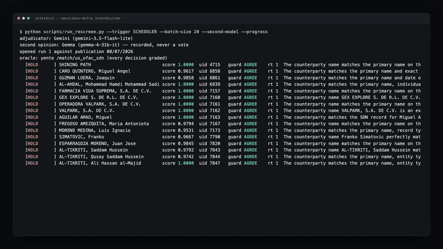
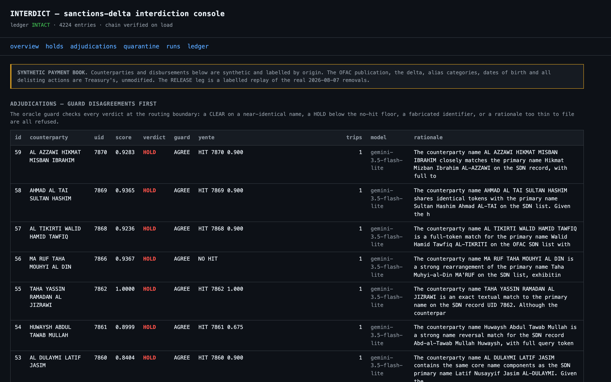
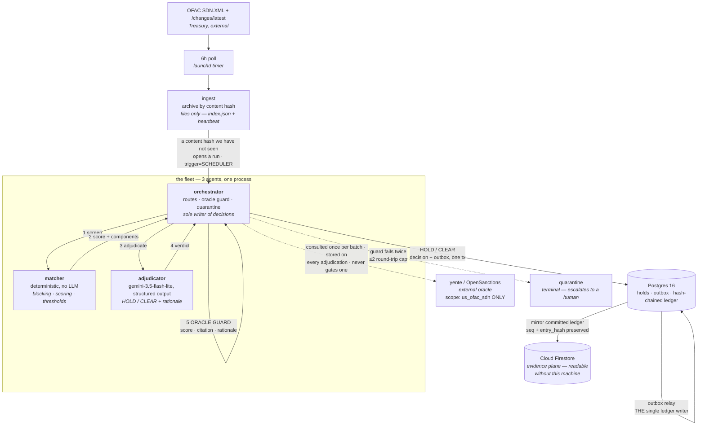
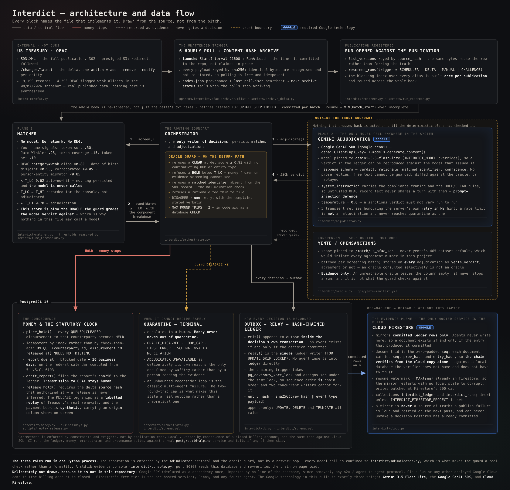

<div align="center">


<h1>Interdict 🏦</h1>

<p><em>When Treasury updates the OFAC list, it re-screens the whole payment book, holds true hits, clears lookalikes with written reasons, releases funds on delisting, and drafts the 10-day blocking report — unattended.</em></p>

<!-- The animated hero is 15 KB against the PNG's 1.6 MB and carries the flow itself:
     a payment in flight hits the delta and freezes. CSS + SMIL only, no script and no
     external refs, so it animates inside  on GitHub. The <picture> keeps the PNG as a
     real fallback for renderers that will not take SVG, and the SVG's own first frame is a
     complete static hero, so a renderer that shows only frame one still shows the mark. -->
<picture>
  <source srcset="docs/assets/readme-hero-animated.svg" type="image/svg+xml">
  
</picture>

<!-- Every number on the judge page is printed by a command in this repo, and the page
     names the command above each one. Nothing there is typed in by hand. -->
**101 synthetic counterparties re-screened against the 19,199 records of the 08/07/2026 OFAC
publication: 59 held, $1,181,434.51 frozen, 0 quarantined, ledger chain intact.**
Reproduce the whole thing with `make reproduce`.

<br/>

[](https://interdict.edycu.dev/judge/)
[](https://youtu.be/C1VFGSwS7w4)
[](https://interdict.edycu.dev/)
[](https://interdict.edycu.dev/pitch-deck.html)
[](https://devpost.com/software/interdict-ocnrbh)
[](https://allthingsagentichackathon.devpost.com/)

<br/>


[](https://github.com/edycutjong/interdict/releases/latest)
[](https://opensource.org/licenses/MIT)
[](https://github.com/edycutjong/interdict/actions/workflows/ci.yml)

<sub>The judge page is a 30-second verification path with every number and its source — mirrored in <a href="JUDGE.md"><code>JUDGE.md</code></a>.</sub>

</div>

---

## 📸 See it in Action

<!-- 8 seconds of a real re-screen, not a mockup: verdicts arriving from Gemini with the
     deterministic score, the uid, and the oracle guard's result on every row. 1.9 MB at
     10fps/900px — a 12fps 1080p version of the same clip was 20 MB, and nobody reads a
     README that costs 20 MB to open. -->


<sub>A real run. Every row is a decision, and the money stops on each one.</sub>




Run history, held money against the statutory clock, every adjudication with its
rationale and the oracle beside it, quarantine, and the ledger with its chain verified
on page load. The `model` column names whichever adjudicator produced each verdict, so
a viewer can see at a glance whether it came from the product path or the offline
stand-in.

Every screenshot in this README is the console reading a real run — the one described
under [Decision quality](#decision-quality--graded-against-ground-truth-the-system-cannot-see),
captured after it finished. They are re-taken whenever the numbers change; none of them
is a mockup.

More: [overview](docs/assets/screenshots/console-overview-dark.png) ·
[holds](docs/assets/screenshots/console-holds-dark.png) ·
[runs](docs/assets/screenshots/console-runs-dark.png) ·
[quarantine](docs/assets/screenshots/console-quarantine-dark.png) ·
[ledger](docs/assets/screenshots/console-ledger-dark.png)

## 💡 The Problem & Solution

### The Problem

Every US person is strictly liable for payments to OFAC-designated parties — including a
12-person humanitarian NGO with no compliance department. When Treasury publishes a
change to the SDN list, the entire counterparty book has to be re-screened before the
next disbursement run. A true hit must be blocked and reported within **10 business
days**. A delisting means blocked funds must be released.

Screening vendors sell this to banks for $30k+/year. They do not sell to this operator
at all. So it gets done by hand, late, or not at all.

### The Solution

One flow, end to end, with no human in the loop:

> **OFAC delta lands → full-book re-screen → true hits held (money stops) → lookalikes
> cleared with written rationale → funds released on delisting → 10-day blocking report
> drafted.**

#### The four autonomous decisions

Each one acts without a click, and each is graded against something we do not control.

| | Decision | What moves | Who grades it |
|---|---|---|---|
| 1 | **HOLD** | an idempotent hold freezes every queued disbursement to the counterparty | the SDN record on treasury.gov; `make challenge` reproduces it for any name |
| 2 | **CLEAR** | the disbursement proceeds, with the reason on record — the signal breakdown that ended it, or the model's rationale when the band was close enough to spend one | OpenSanctions **yente**, scope-pinned to `us_ofac_sdn` |
| 3 | **RELEASE** | a delisting retires the hold and the money moves again | Treasury's own published delta (`/changes/latest`) |
| 4 | **REPORT** | the blocking report is drafted against the statutory clock and filed to the ledger | the federal calendar, 5 U.S.C. 6103 |

## 🏗 Architecture & Tech Stack

Three agents behind one routing boundary. The deterministic plane is the **oracle for the
model plane**, and the guard sits on the return path so a verdict is checked before it is
allowed to move money.

**They run in a single process.** The separation is enforced by the `Adjudicator`
protocol and the oracle guard, not by a network hop — every model call is confined to
`interdict/adjudicator.py`, which is what makes the guard in `interdict/orchestrator.py`
a real check rather than a formality. Calling this a fleet of microservices would be a
nicer diagram and a false one.



The drawn version below carries the detail this graph leaves out — every block names the
file that implements it, the trust boundary around everything Interdict does not author
(Gemini's output and yente's opinion) is drawn rather than described, and the three Google
technologies actually in the build are marked. It is traced from the source, not from the
pitch, and the footer names what is deliberately *not* in this repository.



[Full resolution](docs/assets/architecture-diagram.png)

### The stack

| Layer | Choice | Where it runs |
|---|---|---|
| Adjudication | **`gemini-3.5-flash-lite`** — the pinned default (`INTERDICT_MODEL` overrides it); structured output via `response_schema`, a system instruction carrying the compliance framing, temperature 0 for reproducible verdicts | Gemini API |
| Agent framework | **Google GenAI SDK** (`google-genai`) — every model call, confined to one module | — |
| Evidence plane | **Cloud Firestore** — committed ledger entries mirrored with `seq` and `entry_hash`, so the chain verifies from the cloud copy alone | Google Cloud |
| Correctness core | **Postgres 16** — append-only triggers, illegal-transition checks, hash chain under an advisory lock. The constraints above *are* the product | local, Docker |
| Messaging | transactional **outbox** relay in Postgres — single ledger writer | local |
| Trigger | **launchd** 6h poll — a content hash we have not seen starts the re-screen itself, under a lock. Timer committed at [`ops/com.interdict.ofac-archiver.plist`](ops/com.interdict.ofac-archiver.plist); `make archive-status` fails if the poll stops **or if an attempted re-screen did not succeed**. That second check is new, and the [trigger outage](#️-what-is-real-and-what-is-not) it exists because of is disclosed | local |
| Screening | Python 3.11, rapidfuzz | local |
| Oracle | OpenSanctions **yente**, scope-pinned to `us_ofac_sdn` | local, Docker |

**On what is not here.** An earlier revision of this table claimed Cloud Run, Cloud SQL,
Pub/Sub and Cloud Scheduler. None of them were ever deployed — the GCP billing account
this project had access to is closed, and Firestore's free tier is the one Google Cloud
service that runs without one. The table above is what actually executes. Postgres is
local by consequence and stays local by choice: the triggers and the advisory-lock hash
chain are the interesting part, and they are the same code against Cloud SQL.

### Why the guard is the interesting part

The FEF criterion asks how the system recovers when a worker agent loops or returns a
hallucination. It does not trust the answer:

- a **CLEAR on a near-identical name** with no contradicting DOB or entity type is refused
- a **HOLD below the no-hit floor** — freezing money on evidence the screening plane cannot see — is refused
- a **`matched_identifier` that does not appear in the record** is refused. A fabricated alias transcribed into a federal blocking report is the worst output this system could produce
- a **rationale too thin to file** is refused

On refusal it asks once more *with the disagreement stated*, then stops and escalates.
The cap is **two round trips**, enforced in code and again as a database constraint —
an unbounded reconsider loop is the classic multi-agent failure.

It deliberately does **not** block a CLEAR backed by a contradicting date of birth or an
entity-type mismatch. That case is exactly what the model is for.

### "The model was wrong" and "the model did not answer" are different failures

They were the same failure here until the first full run against real Gemini, which
quarantined **438 of 536** counterparties. Not one of them was a bad verdict: the free
tier allows five requests a minute, every call after the first twenty-one returned `429
RESOURCE_EXHAUSTED`, and each one was caught by a bare `except` and filed as a suspected
model-integrity failure.

That is a worse bug than the rate limit. Quarantine is the terminal state where a human
compliance officer is told the system could not safely decide. Spending it on a transient
network condition means the queue fills with noise, and the one entry that genuinely needs
a person is buried in 438 that only needed thirty seconds.

So the two are now separated:

| | `PARSE_ERROR` | `ADJUDICATOR_UNAVAILABLE` |
|---|---|---|
| means | the verdict cannot be trusted | the verdict was never produced |
| fixed by | a human reading the evidence | waiting |
| before reaching quarantine | no retry — the answer was bad | 5 attempts, honouring the server's own `retry in Ns` hint |

Money still moves in neither case. The difference is what the operator is told, and
whether the system resolves it without them.

### Correctness lives in the database

| Invariant | How |
|---|---|
| the ledger cannot be rewritten | append-only triggers reject UPDATE, DELETE and TRUNCATE |
| the audit trail cannot fork | hash chain built under an advisory lock; `seq` assigned under the *same* lock, so sequence order is chain order |
| re-screens cannot double-hold | `UNIQUE ... NULLS NOT DISTINCT` on the active hold |
| screened money cannot skip states | illegal-transition trigger on every disbursement |
| a crash cannot skip counterparties | batch checkpointing; resume is `MIN(batch_start)` over incomplete batches, and a run closes only when claimed coverage reaches the end of the book |
| a checkpoint outlives the process that wrote it | **each batch commits.** The whole book used to run in one transaction, so a real `SIGKILL` rolled the checkpoints back with the decisions and the resume had nothing to resume from — it only ever worked after a graceful stop, the one case that does not need it. `test_checkpoints_survive_a_process_death` asserts durability from a second connection |

## 🏆 Google Stack & Fortified Enterprise Fleet

Three Google technologies, each load-bearing. Remove any one and a leg of the product
stops working — none of them is decoration.

| Technology | What it does here | Call sites |
|---|---|---|
| **Google GenAI SDK** (`google-genai`) | four surfaces, each load-bearing: `genai.Client(api_key=…)`; `client.models.generate_content(model, contents, config=…)` with `system_instruction` carrying the compliance framing, `response_mime_type: application/json`, `response_schema: VERDICT_SCHEMA` and `temperature: 0.0` so a sanctions decision does not vary run to run; `client.models.count_tokens(...)` to price a run **before** spending quota on it; and `client.models.list()` to refuse to start when the pinned model is not served to the key | [`interdict/adjudicator.py`](interdict/adjudicator.py) — the **only** module in the tree that may call a model |
| **`gemini-3.5-flash-lite`** | issues the HOLD / CLEAR verdict with a citation into the OFAC record and a signable rationale. Pinned as the default; `INTERDICT_MODEL` overrides it, and the `model` column on every decision names whichever adjudicator produced it | [`interdict/adjudicator.py`](interdict/adjudicator.py), surfaced in the console's `model` column |
| **`gemma-4-31b-it`** — second model | asked the **same** question under the **same** system instruction, and recorded on every adjudication whether or not it agrees. Deliberately **not** in the decision path: it cannot hold money, clear a counterparty or route anything to quarantine. Divergence between two independent models is a signal for the human reading the console, never a vote. `NULL` means *not asked or unreachable* — never *agreed* | [`interdict/adjudicator.py`](interdict/adjudicator.py) `GemmaSecondOpinion`; `gemma_verdict` column, `gemma` column in the console. Opt in with `--second-model` |
| **Cloud Firestore** | the evidence plane. `firestore.Client(project, database)`, `.collection().order_by("seq", direction=firestore.Query.DESCENDING)` to find the high-water mark, then `.batch()` / `batch.set(ref, e)` / `batch.commit()` with document ids as zero-padded `seq`, so a re-run overwrites rather than duplicates. Run summaries go through `.set(run, merge=True)` | [`interdict/cloud.py`](interdict/cloud.py) |

The Firestore mirror is what makes the audit trail real: every committed ledger entry
leaves the machine with its `seq`, `prev_hash` and `entry_hash` intact, so **the chain
verifies from the cloud copy alone** — against a local database the verifier does not
have and does not have to trust. It is resumable with no local state, and a publish
failure is loud and retried on the next pass; it cannot unmake a decision Postgres has
already committed. Firestore is a mirror and never a source of truth.

### How the track criteria are met

| Fortified Enterprise Fleet criterion | Where it lives |
|---|---|
| a worker agent returns a hallucination | the **oracle guard** refuses fabricated identifiers, thin rationales, and CLEARs on near-identical names — [see above](#why-the-guard-is-the-interesting-part) |
| a worker agent loops | **two round trips**, capped in code *and* as a database constraint |
| a worker agent is simply unavailable | `PARSE_ERROR` and `ADJUDICATOR_UNAVAILABLE` are [separated](#the-model-was-wrong-and-the-model-did-not-answer-are-different-failures); only one of them spends quarantine |
| decisions are auditable after the fact | append-only hash-chained ledger in Postgres, mirrored to Cloud Firestore |
| the fleet runs unattended | a launchd 6h poll opens a run on any content hash it has not seen — and **both** outages in that loop are disclosed rather than hidden: the [five-day poll outage](#️-what-is-real-and-what-is-not), and the armed trigger that never once completed a run until 2026-08-27 |

## 📊 Engineering Rigor

Every figure below is produced by a script in this repo and can be re-run.

### Screening quality — measured on names that are *not* on the list

Screening the seeded book verbatim scores **top-1 = 1.000**, and that number is close to
worthless: those names were copied out of the very publication being searched, so
finding them is a string-equality test wearing a costume.

So the reported number screens **deterministic perturbations** instead — transliteration
families taken from OFAC's own alias lists, token reordering, dropped particles,
transcription confusables, dropped middle names. Each variant is derived from the
SHA-256 of the name, so the challenge set is byte-identical on any machine.

| | Interdict | yente (independent) |
|---|---|---|
| recall | **1.000** | — |
| **top-1** | **0.995** | **0.840** |
| reaching the adjudication bar | 0.978 | — |

`make challenge-set` · full result set in [`data/g1-perturbed.json`](data/g1-perturbed.json)

**Our two figures are reproducible; the oracle's is not, and it should not be.** The
perturbations are derived from the SHA-256 of each name, so `recall` and `top-1` come back
byte-identical on any machine — re-running them against a five-version `rapidfuzz` upgrade
(3.9.7 → 3.14.5) returned exactly `0.995` again. yente's column is different: it queries a
live OpenSanctions index that keeps tracking Treasury, so it drifts. The recorded run
measured **0.840**; a re-run on 2026-08-23 measured **0.845**, and a screenshot taken in
between caught **0.843**.

Those are the same result, not three results — the gap we clear is roughly sixteen points
wide and no version of the oracle's number changes the conclusion. The committed JSON is
kept as the dated evidence of one run rather than silently refreshed, because a file that
quietly tracks whatever the oracle said this morning is not evidence of anything.

### Decision quality — graded against ground truth the system cannot see

Measured on a **stratified sample of 101** counterparties, adjudicated by
`gemini-3.5-flash-lite`. Free-tier Gemini caps requests per model per project per day, so
grading every one of 536 against the real model is not something that fits in a day; the
sample keeps all four strata and holds the two that test judgement at full strength.
Reproduce with `python scripts/load_book.py --truncate --sentinels 30 --variants 30
--lookalikes 30`.

The book carries the verdict a correct system must reach. The screening path never reads
that column — the orchestrator does not know it exists.

| population | | expected | correct | reached the model |
|---|---|---|---|---|
| **sentinel** (30) | on the list, exact names | HOLD | 30 / 30 | 30 |
| **variant** (30) | same person, different transliteration | HOLD | 29 / 30 | 29 |
| **lookalike** (25) | *different* person, shared surname, contradicting DOB | CLEAR | 25 / 25 | **0** |
| **ordinary** (16) | unrelated grantees | CLEAR | 16 / 16 | **0** |

**1 missed hit in 60. 0 frozen grantees in 41.** The two errors are reported separately
because they are not equivalent: a missed hit is a payment to a designated party, a frozen
grantee is aid stopped in error. The one miss is `AZIZ ATRIQ` at 0.6594 — a transliteration
the *screening* plane scored below the adjudication bar, so the model never saw it.

#### The right-hand column is the honest part

**Not one CLEAR-expected counterparty reached the model.** All 59 adjudications came back
HOLD, and every clear in this book was issued by the deterministic plane, because a
contradicting date of birth cuts a lookalike below `T_HI` before adjudication is ever
spent on it.

That is the design working — proving two people are different from documented evidence
does not need a language model, and the cheap path is also the auditable one. But it
means this table grades **the matcher on clears and the model on holds**, and an earlier
revision of it reported "lookalike CLEAR 60/60" as decision quality when the adjudicator
had played no part. The model's demonstrated contribution here is confirming 59 holds
with a citation and a signable rationale, and disagreeing with none of them.

### Agreement with the independent oracle, on every decision

yente is consulted for **every** adjudication, not only where it agrees — an oracle
consulted selectively is not an oracle.

| | count |
|---|---|
| both flagged a hit | **58** |
| we held, yente missed | 1 |
| **we cleared, yente flagged** | **0** |

The zero is the one that matters. Under strict liability the dangerous direction is
being *more permissive* than the oracle, and we never are.

The oracle guard passed all 59 verdicts (`AGREE`), and nothing reached quarantine.

### Performance

`make bench` — deterministic screening plane, 400 counterparties against all 19,199 SDN
records of the **08/07/2026 publication** — the snapshot this whole build is sealed to; see
[What is real, and what is not](#️-what-is-real-and-what-is-not):

| p50 | p95 | p99 | 400-counterparty pass |
|---|---|---|---|
| **9.3 ms** | 68.8 ms | 106.7 ms | **7.6 s** |

OFAC publishes roughly weekly.

## 🚀 Getting Started

### Prerequisites

Docker (Postgres, Elasticsearch and yente run in it), Python 3.11, and a free Gemini API
key from [aistudio.google.com/apikey](https://aistudio.google.com/apikey) — no billing
account required.

### Installation

```bash
make install          # venv + dependencies
make up               # Postgres + Elasticsearch + yente
make oracle-index     # index us_ofac_sdn (once)
make schema
make fetch-sdn        # 27MB from Treasury, follows the S3 redirect

make test             # 361 tests, 100% coverage
make challenge-set    # the perturbed screening number
make bench            # p50/p95

export GEMINI_API_KEY=...                 # free, no billing: aistudio.google.com/apikey

# Optional -- the cloud evidence plane. Without these the run is identical except that
# nothing is mirrored; Firestore is where the audit trail becomes readable off-machine.
export INTERDICT_FIRESTORE_PROJECT=your-project
export GOOGLE_APPLICATION_CREDENTIALS=/path/to/sa.json   # roles/datastore.user

python scripts/load_book.py --truncate    # the labelled synthetic book
python scripts/run_rescreen.py --budget-only   # price the run before spending quota
python scripts/run_rescreen.py            # what the timer starts on its own
python scripts/run_rescreen.py --second-model  # also record an independent Gemma verdict
python scripts/adjudication_quality.py    # graded against ground truth
python scripts/replay_release.py          # the labelled Aug-7 release replay
python -m interdict.console               # evidence console on :8080
```

**`run_rescreen.py` refuses to run without a Gemini key.** It does not fall back to a
stand-in, because a reproduce command that quietly disables the thing being judged is
worse than one that fails. `--offline` runs the deterministic plane alone and says so on
every line of output; that is what CI uses, and it is the only honest way to describe
such a run.

Or `make reproduce` for all of it.

Screen any name yourself — this is the point, and it works on names we never chose:

```bash
make challenge NAME="Ibrahim Al Rashid"
make challenge NAME="Abu Abbas" DOB="3 Mar 1990"     # contradicting DOB kills the hit
```

## 🧪 Testing & CI

```bash
make test                       # 361 tests, 100% coverage
make verify-ledger              # hash chain, end to end
make verify-book                # all 400 sentinels still listed in the current publication
make archive-status             # fails if the 6h poll has stopped
```

CI runs a real Postgres and **fails if the database tests silently skip** — a green badge
over skipped ledger invariants would read as proof of something that was never checked.

| Workflow | What it gates |
|---|---|
| [`ci.yml`](.github/workflows/ci.yml) | lint, types, the full suite against a real Postgres service |
| [`codeql.yml`](.github/workflows/codeql.yml) | static analysis |
| [`gitleaks.yml`](.github/workflows/gitleaks.yml) | secret scanning across history |
| [`pages.yml`](.github/workflows/pages.yml) | publishes `site/` — asserts the og-image dimensions and the CNAME before deploying |
| [`release.yml`](.github/workflows/release.yml) | version bump, changelog, tag, GitHub Release |

Two tests worth naming: `test_ofac_schema_typo_is_pinned` pins OFAC's own misspelling of
`publishInformation` as **`publshInformation`**, so a Treasury fix fails loudly instead of
silently emptying the publication date; and `test_checkpoints_survive_a_process_death`
asserts checkpoint durability from a second connection after a real `SIGKILL`.

## 🎬 Demo Materials

- **[The judge page](https://interdict.edycu.dev/judge/)** — the claim, a 30-second click
  path, every receipt with the command that printed it, and the limitations. Mirrored in
  [`JUDGE.md`](JUDGE.md).
- **[`DEMO.md`](DEMO.md)** — nine beats, each with the command above its output.
- **[Demo video](https://youtu.be/C1VFGSwS7w4)** — 3:43, unedited live execution with the Cloud Firestore console on screen.
- **[Landing page](https://interdict.edycu.dev/)** · **[Pitch deck](https://interdict.edycu.dev/pitch-deck.html)**

## ⚖️ What is real, and what is not

Stated plainly, because a screening demo that blurs this is worthless.

**Real — none of it ours:** the OFAC SDN publication (08/07/2026, 19,199 records), the
`/changes/latest` delta and its 18 additions / 8 removals, every alias category
including the 4,393 OFAC-flagged weak aliases, every date of birth, every sanctions
programme, and the delisting actions. Archived by content hash in
[`data/archive/`](data/archive/) with hashes in [`data/PROVENANCE.md`](data/PROVENANCE.md).

**Ours, and labelled synthetic everywhere it appears:** the payment book. A real NGO's
grantee ledger is not ours to publish. Counterparties carry an `origin` column and the
console and demo label them on screen.

**The RELEASE leg is a labelled REPLAY.** The eight delisted parties are already gone
from the 08/07 publication, so a live release cannot be staged against today's list
without pretending. The pre-removal state is reconstructed from the delta's own records
and Treasury's real removals are then applied. It says REPLAY on every screen.

The 400 sentinels were sealed and committed with their SHA-256 **before** any later
publication existed — so if OFAC delists one of them, `git log` proves the book predates
the removal. That is the path to a genuinely live release, and it is upside rather than
the plan.

**As of 08/20/2026 no sentinel has fired.** Treasury published again on 08/20 — 19,199
records to 19,249, and the archived `changes/latest` delta carries 47 additions and no
removals — and `make verify-book` reports all 400 sentinels still listed in that
publication. So the release leg is still the labelled replay, and this paragraph will say
so until it is not true. (`changes/latest` holds only the most recent action, which is why
47 additions and a 50-record rise are not the same number.) The 08/20 delta is archived
alongside the 08/07 one: a real Treasury trigger, published during the build, that nobody
here chose — the HOLD leg runs against it live.

**The 6-hourly poll had a five-day outage**, 2026-08-17 to 08-22, and the 08/20
publication was captured late because of it. A lint pass modernised `datetime.timezone.utc`
into `datetime.UTC` while the timer was invoking Python 3.9, so every poll died into a log
nobody was reading. It is disclosed here because "unattended" is a claim this project makes
and that is what an outage in it looks like. The fix is in `git log`; the check that would
have caught it on the first missed window is `make archive-status`, which did not exist and
now does.

**The armed trigger had never once fired a completed run**, 2026-08-15 to 08-27. The poll
was alive the whole time — 37 of them, four real publications captured — but on both
occasions a publication arrived and the re-screen actually started, it died at import:
`ModuleNotFoundError: No module named 'psycopg'`. The timer's interpreter was the system
framework Python, which is new enough to run the archiver (pure stdlib) and has none of this
project's dependencies, and `archive_delta.py` spawns the child with `sys.executable` — so it
faithfully handed the re-screen an interpreter that could not import its own code. Two for
two, into the same gitignored log as last time.

This is the second outage in the same loop and it is disclosed for the same reason: the
sentence *"a content hash we have not seen starts the re-screen itself"* describes a
mechanism that, until 08-27, had never completed. The fix points the timer at `.venv/bin/python3`
and is in `git log`. The deeper fix is that `make archive-status` now fails on a re-screen
that was attempted and did not succeed — it previously checked only that the *poll* was
alive, which is how a loop that never closed looked green for eleven days. **The mechanism is
repaired and tested; it has not yet had a live publication to fire on.** That sentence will
stay here until it has.

**Transmission to OFAC stays human.** Interdict drafts the blocking report and files it
to the ledger. It does not submit it.

## 📌 Known limitations

- **Vessels and aircraft** are screened by name only; IMO and tail numbers are parsed but not scored.
- **The model has never issued a CLEAR.** Every clear in the graded book came from the deterministic plane, because a contradicting date of birth ends the question before adjudication. So the adjudicator is exercised on confirmation, not on discrimination — see the note under the decision-quality table.
- **Decision quality is a 101-row stratified sample, not the full book.** Free-tier Gemini allows a fixed number of requests per model per project per day; the full 536 would take several days of quota. The *screening* numbers are unaffected and still measured across all 400.
- **One transliteration in thirty** (`AZIZ ATRIQ`, score 0.659) falls below the adjudication bar.
- **The second model agreed 59 out of 59, and that is a weaker result than it looks.** Every one of those 59 is a HOLD confirmation, because a contradicting date of birth ends a lookalike before either model is consulted. So Gemma — exactly like Gemini — has not yet been asked to discriminate, and 59/59 agreement measures two models confirming the same easy cases, not two models cross-checking hard ones. Reported because the number would otherwise read as stronger evidence than it is.
- **Nothing runs on Google Cloud compute.** Firestore holds the audit trail; the agents, Postgres and yente run locally, because the free tier does not extend to Cloud Run and no billing account was available.
- yente's own recall on the perturbed set is 0.840, so part of the agreement gap is the oracle missing, not us.

## 🏷 Versioning

[Semantic Versioning](https://semver.org/spec/v2.0.0.html), starting at **1.0.0**. The
version lives in one place — `__version__` in [`interdict/__init__.py`](interdict/__init__.py)
— and [`CHANGELOG.md`](CHANGELOG.md) records what each release changed.

Releases are cut by [`.github/workflows/release.yml`](.github/workflows/release.yml) on every
push to `main`: it works out the bump, rewrites the version, prepends a changelog section,
tags `vX.Y.Z` and publishes a GitHub Release.

This repository's commit subjects are prose rather than `feat:` / `fix:` prefixes, and a
conventional-commits-only release tool would therefore find nothing to release on any push,
forever, while reporting success. So prefixes are honoured **when present** and the default
is a patch bump:

| Commit | Bump |
|---|---|
| `feat: …` | minor |
| `feat!: …`, `fix!: …`, or `BREAKING CHANGE:` in the body | major |
| anything else — including this project's ordinary prose subjects | patch |

The level can also be chosen by hand from the Actions tab. Six tests in
[`tests/test_version.py`](tests/test_version.py) fail the build if the version, the changelog
and the workflow's insertion anchor ever drift apart.

## 📄 License

[MIT](LICENSE). Contributing guide, code of conduct and the security policy live in
[`.github/`](.github/) — [CONTRIBUTING](.github/CONTRIBUTING.md) ·
[CODE_OF_CONDUCT](.github/CODE_OF_CONDUCT.md) ·
[SECURITY](.github/SECURITY.md).

**Note on use.** Interdict is a hackathon project, not a compliance product. It drafts OFAC
blocking reports; it does not file them, and no output of this software is legal advice or a
substitute for a qualified compliance officer. Also in [`NOTICE`](NOTICE).

## 🙏 Acknowledgments

- **OpenSanctions / yente** (MIT) — run unmodified as the external oracle.
- **rapidfuzz** (MIT), **psycopg** (LGPL), **httpx** (BSD).
- **google-genai** SDK — the only model SDK in the tree. Google ADK is *not* used: it was
  declared as a dependency for a while, never imported by a line of this codebase, and has
  been removed from `requirements.txt`.
- Built with AI coding assistance, which the rules permit as standard tooling.

All application code in this repository was written during the submission period.
