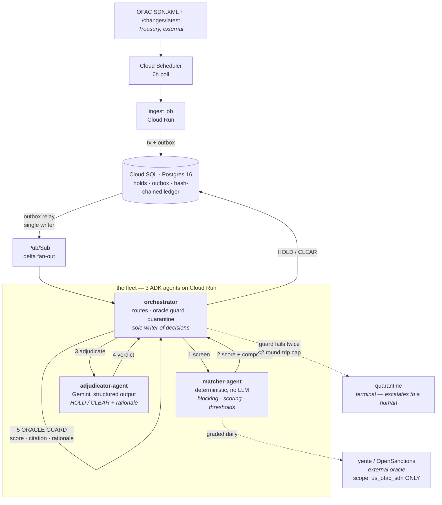

<div align="center">


# Interdict

**When Treasury updates the OFAC list, it re-screens the whole payment book, holds true hits, clears lookalikes with written reasons, releases funds on delisting, and drafts the 10-day blocking report — unattended.**


[**Demo video**](#-demo) · [**Reproduce the numbers**](#-reproduce) · [**Architecture**](#-architecture)


</div>

---

## 🎯 The problem

Every US person is strictly liable for payments to OFAC-designated parties — including a
12-person humanitarian NGO with no compliance department. When Treasury publishes a
change to the SDN list, the entire counterparty book has to be re-screened before the
next disbursement run. A true hit must be blocked and reported within **10 business
days**. A delisting means blocked funds must be released.

Screening vendors sell this to banks for $30k+/year. They do not sell to this operator
at all. So it gets done by hand, late, or not at all.

## ⚙️ What it does

One flow, end to end, with no human in the loop:

> **OFAC delta lands → full-book re-screen → true hits held (money stops) → lookalikes
> cleared with written rationale → funds released on delisting → 10-day blocking report
> drafted.**

### The four autonomous decisions

Each one acts without a click, and each is graded against something we do not control.

| | Decision | What moves | Who grades it |
|---|---|---|---|
| 1 | **HOLD** | an idempotent hold freezes every queued disbursement to the counterparty | the SDN record on treasury.gov; `make challenge` reproduces it for any name |
| 2 | **CLEAR** | the disbursement proceeds, with a written rationale | OpenSanctions **yente**, scope-pinned to `us_ofac_sdn` |
| 3 | **RELEASE** | a delisting retires the hold and the money moves again | Treasury's own published delta (`/changes/latest`) |
| 4 | **REPORT** | the blocking report is drafted against the statutory clock and filed to the ledger | the federal calendar, 5 U.S.C. 6103 |

## 📊 The numbers

Every figure below is produced by a script in this repo and can be re-run.

### Screening quality — measured on names that are *not* on the list

Screening the seeded book verbatim scores **top-1 = 1.000**, and that number is close to
worthless: those names were copied out of the very publication being searched, so
finding them is a string-equality test wearing a costume.

So the reported number screens **deterministic perturbations** instead — transliteration
families taken from OFAC's own alias lists, token reordering, dropped particles,
transcription confusables, dropped middle names. Each variant is derived from the
SHA-256 of the name, so the challenge set is byte-identical on any machine.

| | Interdict | yente (independent) |
|---|---|---|
| recall | **1.000** | — |
| **top-1** | **0.995** | **0.840** |
| reaching the adjudication bar | 0.978 | — |

`make challenge-set` · full result set in [`data/g1-perturbed.json`](data/g1-perturbed.json)

### Decision quality — graded against ground truth the system cannot see

The book carries the verdict a correct system must reach. The screening path never reads
that column — the orchestrator does not know it exists.

| population | | expected | correct |
|---|---|---|---|
| **sentinel** (400) | on the list, exact names | HOLD | 400 / 400 |
| **variant** (60) | same person, different transliteration | HOLD | 59 / 60 |
| **lookalike** (60) | *different* person, shared surname, contradicting DOB | CLEAR | 60 / 60 |
| **ordinary** (16) | unrelated grantees | CLEAR | 16 / 16 |

**1 missed hit in 460. 0 frozen grantees in 76.** The two errors are reported separately
because they are not equivalent: a missed hit is a payment to a designated party, a
frozen grantee is aid stopped in error.

### Performance

`make bench` — deterministic screening plane, 400 counterparties against all 19,199 SDN
records:

| p50 | p95 | p99 | full book |
|---|---|---|---|
| **9.3 ms** | 68.8 ms | 106.7 ms | **7.6 s** |

OFAC publishes roughly weekly.

## 🏗 Architecture

Three ADK agents. The deterministic plane is the **oracle for the model plane**, and
because they are separate agents the check is literal inter-agent routing rather than an
internal function call.



### Why the guard is the interesting part

The FEF criterion asks how the system recovers when a worker agent loops or returns a
hallucination. It does not trust the answer:

- a **CLEAR on a near-identical name** with no contradicting DOB or entity type is refused
- a **HOLD below the no-hit floor** — freezing money on evidence the screening plane cannot see — is refused
- a **`matched_identifier` that does not appear in the record** is refused. A fabricated alias transcribed into a federal blocking report is the worst output this system could produce
- a **rationale too thin to file** is refused

On refusal it asks once more *with the disagreement stated*, then stops and escalates.
The cap is **two round trips**, enforced in code and again as a database constraint —
an unbounded reconsider loop is the classic multi-agent failure.

It deliberately does **not** block a CLEAR backed by a contradicting date of birth or an
entity-type mismatch. That case is exactly what the model is for.

### Correctness lives in the database

| Invariant | How |
|---|---|
| the ledger cannot be rewritten | append-only triggers reject UPDATE, DELETE and TRUNCATE |
| the audit trail cannot fork | hash chain built under an advisory lock; `seq` assigned under the *same* lock, so sequence order is chain order |
| re-screens cannot double-hold | `UNIQUE ... NULLS NOT DISTINCT` on the active hold |
| screened money cannot skip states | illegal-transition trigger on every disbursement |
| a crash cannot skip counterparties | batch checkpointing; resume is `MIN(batch_start)` over incomplete batches, and a run closes only when claimed coverage reaches the end of the book |

## 🔬 Reproduce

```bash
make install          # venv + dependencies
make up               # Postgres + Elasticsearch + yente
make oracle-index     # index us_ofac_sdn (once)
make schema
make fetch-sdn        # 27MB from Treasury, follows the S3 redirect

make test             # 131 tests
make challenge-set    # the perturbed screening number
make bench            # p50/p95
```

Or `make reproduce` for all of it.

Screen any name yourself — this is the point, and it works on names we never chose:

```bash
make challenge NAME="Ibrahim Al Rashid"
make challenge NAME="Abu Abbas" DOB="3 Mar 1990"     # contradicting DOB kills the hit
```

## 🎬 Demo

See [`DEMO.md`](DEMO.md).

## ⚖️ What is real, and what is not

Stated plainly, because a screening demo that blurs this is worthless.

**Real — none of it ours:** the OFAC SDN publication (08/07/2026, 19,199 records), the
`/changes/latest` delta and its 18 additions / 8 removals, every alias category
including the 4,393 OFAC-flagged weak aliases, every date of birth, every sanctions
programme, and the delisting actions. Archived by content hash in
[`data/archive/`](data/archive/) with hashes in [`data/PROVENANCE.md`](data/PROVENANCE.md).

**Ours, and labelled synthetic everywhere it appears:** the payment book. A real NGO's
grantee ledger is not ours to publish. Counterparties carry an `origin` column and the
console and demo label them on screen.

**The RELEASE leg is a labelled REPLAY.** The eight delisted parties are already gone
from the 08/07 publication, so a live release cannot be staged against today's list
without pretending. The pre-removal state is reconstructed from the delta's own records
and Treasury's real removals are then applied. It says REPLAY on every screen.

The 400 sentinels were sealed and committed with their SHA-256 **before** any later
publication existed — so if OFAC delists one of them, `git log` proves the book predates
the removal. That is the path to a genuinely live release, and it is upside rather than
the plan.

**Transmission to OFAC stays human.** Interdict drafts the blocking report and files it
to the ledger. It does not submit it.

## 🧰 Stack

| Layer | Choice |
|---|---|
| Adjudication | **Gemini** — structured output via `response_schema`, temperature 0 for reproducible verdicts |
| Agent framework | **Google ADK** — orchestrator, matcher and adjudicator |
| Compute | **Cloud Run** — 3 agent services, ingest job, yente |
| State | **Cloud SQL (Postgres 16)** — the constraints above are the product |
| Messaging | **Pub/Sub** — delta fan-out, transactional outbox relay |
| Trigger | **Cloud Scheduler** — the unattended 6h poll |
| Screening | Python 3.11, rapidfuzz |
| Oracle | OpenSanctions **yente**, scope-pinned |

## 📌 Known limitations

- **Vessels and aircraft** are screened by name only; IMO and tail numbers are parsed but not scored.
- **The adjudication-quality table above was measured on the deterministic stand-in**, so it grades the screening plane rather than model reasoning. Re-run with a Gemini key set to grade the model.
- **One transliteration in sixty** (`AZIZ ATRIQ`, score 0.659) falls below the adjudication bar.
- yente's own recall on this set is 0.840, so ~16% of the agreement gap is the oracle missing, not us.

## 📄 Licence

[MIT](LICENSE).

## 🙏 Pre-existing code and tooling

- **OpenSanctions / yente** (MIT) — run unmodified as the external oracle.
- **rapidfuzz** (MIT), **psycopg** (LGPL), **httpx** (BSD).
- **Google ADK** and **google-genai** SDKs.
- Built with AI coding assistance, which the rules permit as standard tooling.

All application code in this repository was written during the submission period.
